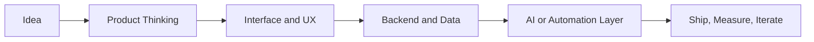

# Thanigaivelen

### Product-Minded Software Engineer

I build AI-powered products, polished user experiences, and full-stack systems that turn rough ideas into usable software.

  
  
  

---

## About Me

I like building software where **product thinking**, **engineering depth**, and **execution speed** all matter at the same time.

My sweet spot is working across the stack:

- shaping product ideas into real user-facing flows
- building clean frontend experiences that feel intentional
- designing backend systems that stay maintainable under real usage
- integrating AI and automation in ways that actually improve the product

I care about products that feel **simple on the surface** and **solid underneath**.

---

## What I Build

<table>
  <tr>
    <td width="50%" valign="top">
      <h3>AI Product Experiences</h3>
      
I build AI features that fit real product flows — not isolated demos. I care about prompt design, evaluation loops, usability, and making AI outputs feel dependable inside the interface.

    </td>
    <td width="50%" valign="top">
      <h3>Full-Stack Product Systems</h3>
      
I enjoy taking ownership across frontend, backend, APIs, data models, and workflows so the final product feels cohesive end to end.

    </td>
  </tr>
  <tr>
    <td width="50%" valign="top">
      <h3>Automation That Reduces Friction</h3>
      
I like building systems that remove repetitive work, improve consistency, and help teams move faster without adding unnecessary complexity.

    </td>
    <td width="50%" valign="top">
      <h3>Interfaces With Strong Product Taste</h3>
      
I value clarity, hierarchy, and usability. Good software should not only work — it should also feel deliberate and easy to trust.

    </td>
  </tr>
</table>

---

## Tech I Work With

### Frontend

### Backend

### AI + Automation

### Tools

---

## How I Usually Build

---

## Current Focus

- building AI-first product experiences that feel practical, not gimmicky
- shipping full-stack TypeScript systems with clean boundaries
- improving product UX while keeping backend logic robust
- creating automation flows that save real operational time

---

## Engineering Principles

- **Build for real usage** — not just for demos
- **Keep the user experience clear** even when the system behind it is complex
- **Prefer simple architecture first** and add complexity only when it earns its place
- **Care about product outcomes**, not just technical output

---

## Open To

- AI product engineering
- full-stack product development
- developer tools and internal tooling
- automation-heavy software workflows

---

## Connect

- **Email:** [thanigaivelen2002@gmail.com](mailto:thanigaivelen2002@gmail.com)

If you're building something thoughtful at the intersection of **product, AI, and engineering**, I'm always interested in good problems.
